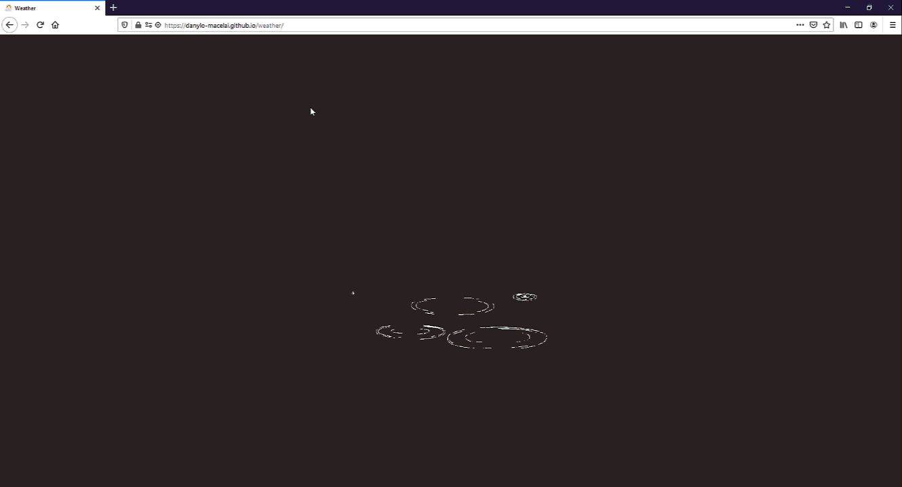

<h1 align="center">{WEATHER}</h1>

## Overview

<div align="center">
    
</div>

## Demo

To access the current state of this demo, please visit the [GitHub Pages Preview](https://danylo-macelai.github.io/weather).

## User Story 

The [</> devchallenges.io](https://devchallenges.io/challenges/mM1UIenRhK808W8qmLWv) was to build an application with [design UI Figma](https://www.figma.com/file/5X3Ao3gEqZPqqKctP7riDF/weather-app?node-id=0%3A1) to complete the user stories:
 
- [x] I can see city weather as default, preferably my current location
- [x] I can search for city
- [x] I can see weather of today and the next 5 days
- [x] I can see the date and location of the weather
- [x] I can see according to image for each type of weather
- [x] I can see the min and max degree each day
- [x] I can see wind status and wind direction
- [x] I can see humidity percentage
- [x] I can see visibility indicator
- [x] I can see air pressure number
- [x] I can request my current location weather (optional)
- [x] I can convert temperature in Celcius to Fahrenheit and vice versa (optional)
 
## How To Use

To clone and run this application, you'll need [Git](https://git-scm.com) and [Node.js](https://nodejs.org/en/download/) (which comes with [npm](http://npmjs.com)) installed on your computer. From your command line:

```bash
# Clone this repository
$ git clone https://github.com/danylo-macelai/weather.git

# Install dependencies
$ npm install

# Run the app
$ npm run dev
```